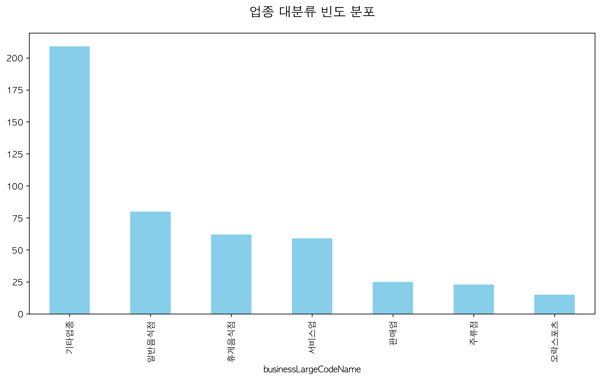
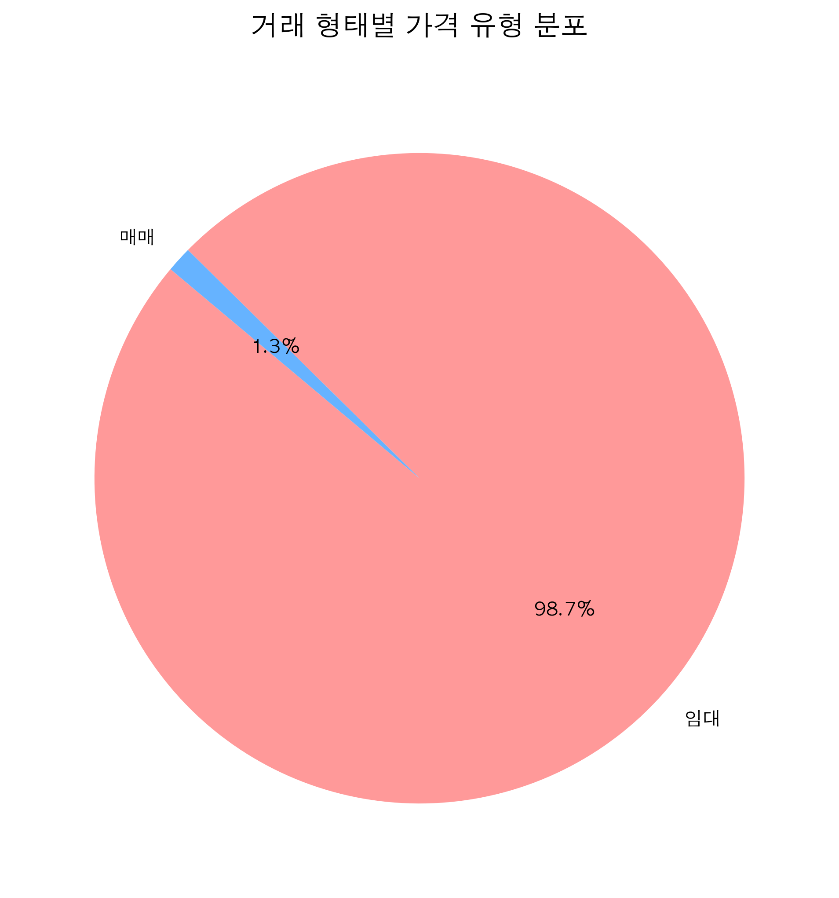
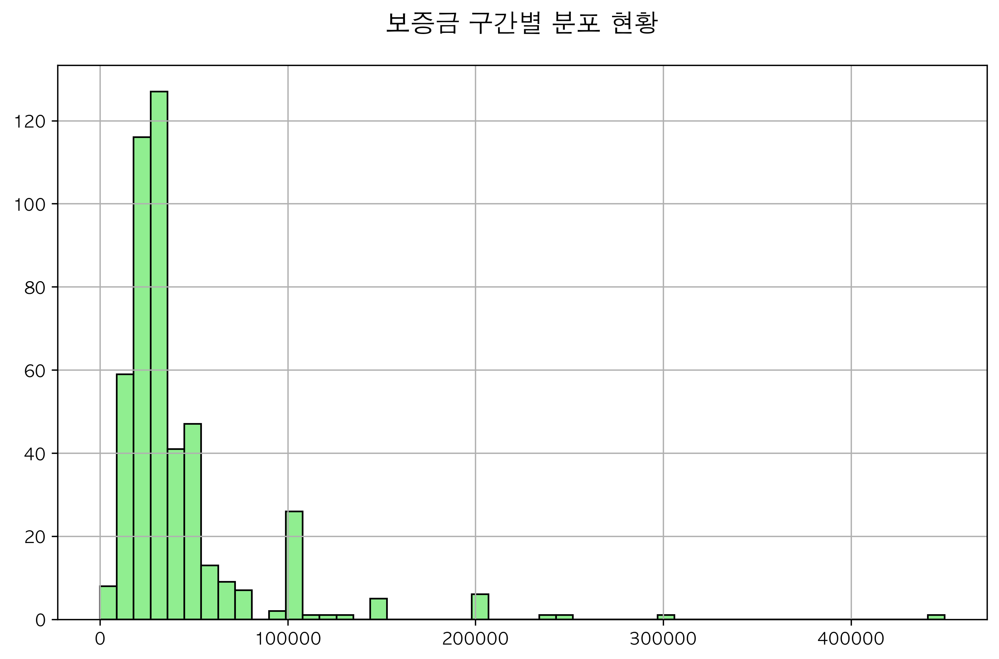
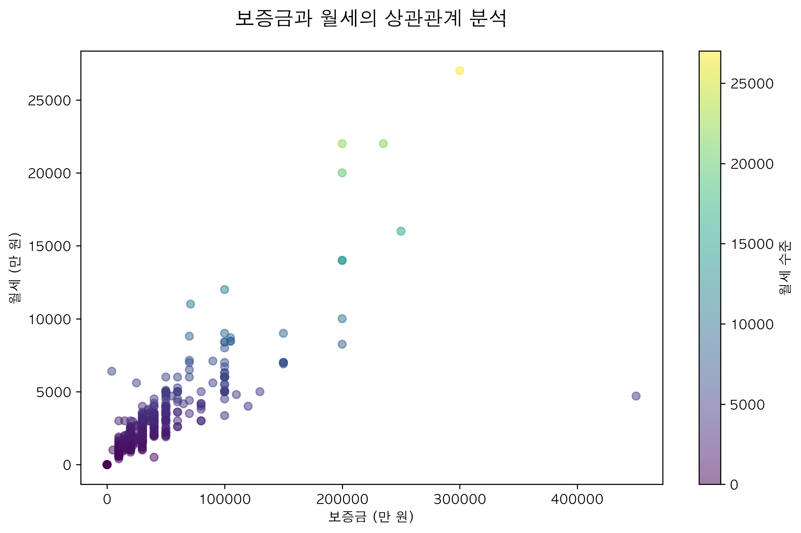
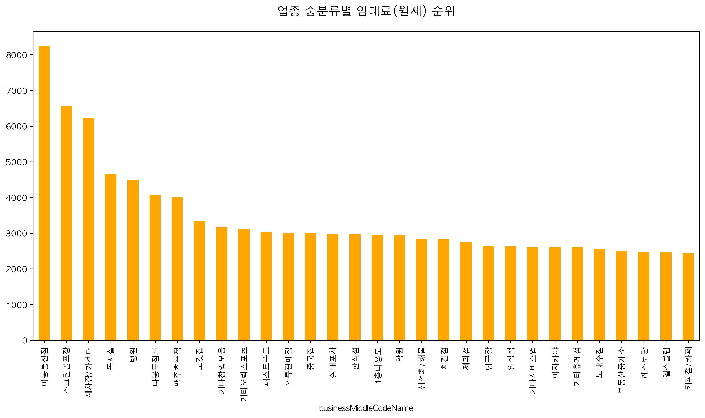
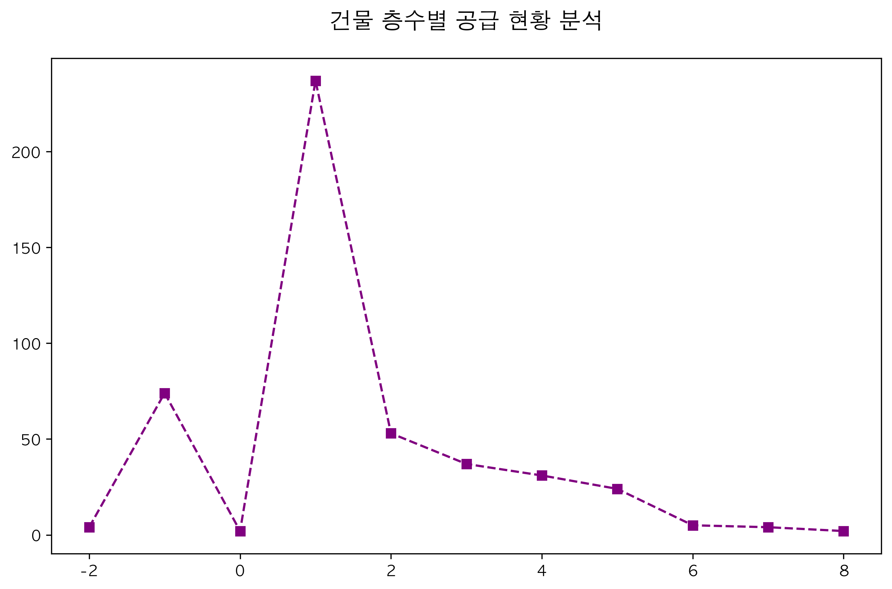
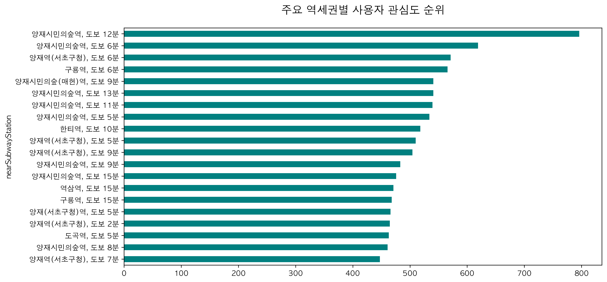
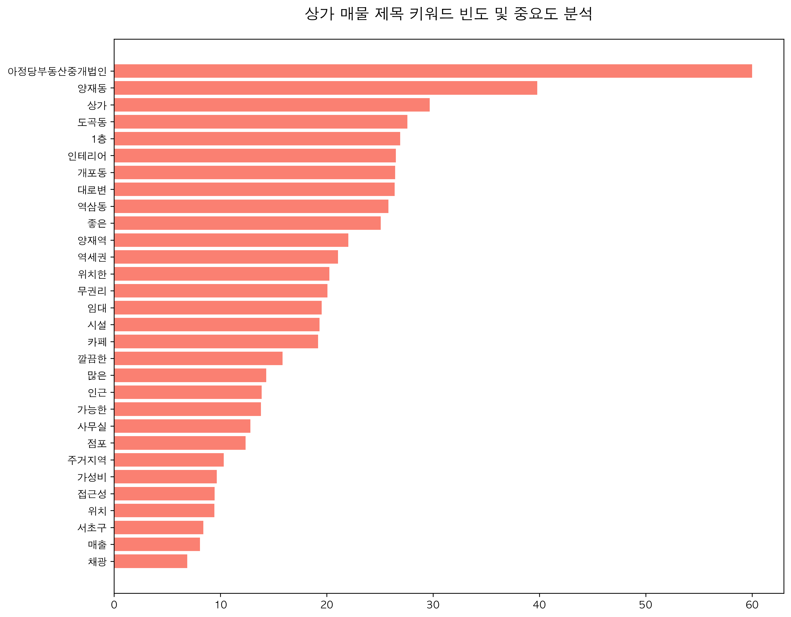

# 🏠 Nemo Store Insight
## 서울 강남권 상가 데이터 심층 분석 보고서

**20년 경력 시니어 데이터 분석가의 통찰**

<!-- 
발표자 노트 (2분 분량 스크립트 요약):
안녕하십니까, 오늘 발표를 맡은 시니어 데이터 분석가입니다. 
우리는 오늘 '네모' 플랫폼의 데이터를 통해 대한민국 상권의 심장부라 할 수 있는 서울 강남권 상가 시장을 현미경으로 들여다보듯 분석해보려 합니다. 
단순한 숫자의 나열이 아니라, 20년간 시장을 지켜본 전문가의 눈으로 데이터 이면에 숨겨진 '돈의 흐름'과 '입지의 가치'를 짚어드리겠습니다. 
강남은 대한민국에서 가장 높은 임대료를 자랑하지만, 그만큼 가장 정교한 데이터 분석이 필요한 곳이기도 합니다. 
본 보고서가 여러분의 비즈니스 의사결정에 확실한 나침반이 되기를 바랍니다. 
-->

---

# 📋 프로젝트 개요

- **분석 대상**: 서울 강남구/서초구 일대 상가 매물 (473건)
- **데이터 소스**: 네모(Nemo) 플랫폼 매물 데이터
- **핵심 목표**: 
  - 강남권 상권의 임대료/권리금 구조 파악
  - 업종별 입지 전략 및 가격 상관관계 도출
  - 비즈니스 의사결정을 위한 데이터 기반 나침반 제공

<!-- 
발표자 노트:
이번 프로젝트의 데이터 셋을 먼저 설명드리겠습니다. 
저희는 강남구와 서초구를 중심으로 총 473건의 실제 상가 매물 데이터를 전수 조사 수준으로 분석했습니다. 
보통 부동산 데이터는 표면적인 가격만 보기 쉬운데, 저희는 네모 플랫폼 특유의 상세 매물 설명과 조회수 같은 사용자 반응 데이터까지 결합했습니다.
핵심 목표는 세 가지입니다. 첫째, 임대료와 권리금이 실제로 어떤 층위에서 형성되는지. 
둘째, 특정 업종이 왜 특정 가격대를 형성하는지. 
셋째, 이를 통해 실제 창업이나 투자 시 어떤 전략을 가져가야 하는지입니다. 
단순 분석을 넘어선 '실행 가능한 전략'에 집중했습니다.
-->

---

# 📊 데이터 개요 및 기술 통계

| 지표 | 평균 | 중앙값 | 최댓값 |
| :--- | :--- | :--- | :--- |
| **보증금** | 4,059만 원 | 3,000만 원 | 4억 5,000만 원 |
| **월세** | 296만 원 | 220만 원 | 2,700만 원 |
| **권리금** | 4,260만 원 | 3,000만 원 | 20억 원 |
| **면적** | 103㎡ (31평) | 79㎡ (24평) | 956㎡ (289평) |

- **시장의 초양극화**: 평균과 최댓값의 큰 격차는 강남 상권의 '자본 집중도'를 대변함.

<!-- 
발표자 노트:
주요 지표들을 살펴보면 강남 상권의 무시무시한 '초양극화'를 한눈에 확인할 수 있습니다. 
평균 보증금이 4천만 원대인데 최댓값은 4억 5천만 원에 달합니다. 
특히 권리금 부분을 주목해 보십시오. 중앙값은 3,000만 원이지만, 최댓값은 무려 20억 원입니다. 
이는 같은 강남 안에서도 'A급 메인 상권'과 '이면 도로'의 격차가 상상을 초월한다는 뜻입니다. 
또한, 평균 면적은 31평으로 중소형 매물이 주를 이루고 있습니다. 
강남에서 창업을 준비한다면, 내가 이 '초양극화'된 스펙트럼 중 정확히 어느 지점을 타겟팅할지 결정하는 것이 가장 우선되어야 합니다.
-->

---

# 📈 [분석 1] 업종 대분류 빈도 분포

- **음식점 중심 상권**: 일반/휴게음식점이 전체의 약 **70%** 차지.
- **인사이트**: 강력한 소비 상권이나, 경쟁이 매우 치열한 Red Ocean임. 차별화 전략 필수.

<!-- 
발표자 노트:
그래프를 보시면 강남권 상가의 업종 분포가 얼마나 편중되어 있는지 알 수 있습니다. 
전체 매물의 약 70%가 일반음식점과 휴게음식점, 즉 '먹고 마시는 장사'에 집중되어 있습니다. 
이는 강남이 대한민국 최대의 소비 상권이라는 반증이기도 하지만, 반대로 해석하면 공급 과잉의 Red Ocean이라는 뜻입니다. 
똑같은 김치찌개, 똑같은 카페로는 이 바다에서 살아남기 힘듭니다. 
데이터가 말해주는 결론은 명확합니다. 여기서 창업하려면 기존 업종과의 '완벽한 차별화'가 있거나, 아니면 아예 다른 30%의 업종(병원, 판매업 등)에서 틈새를 찾아야 합니다.
-->

---

# 💰 [분석 2] 거래 형태 및 보증금 분포

| 거래 형태 | 보증금 구간 분포 |
| :---: | :---: |
|  |  |

- **임대 위주 시장**: 매물의 **98.7%**가 임대차 계약. (자산 보유보다 운영 수익 중심)
- **진입 문턱**: 보증금 **2,000만~5,000만 원** 구간에 가장 많은 매물 밀집.

<!-- 
발표자 노트:
거래 형태를 보면 98% 이상이 임대입니다. 매매 매물은 극히 드문데, 이는 강남 상가 건물을 가진 건물주들이 좀처럼 물건을 내놓지 않는다는 자산 가치의 견고함을 보여줍니다. 
오른쪽 보증금 분포 그래프를 보시죠. 2천만 원에서 5천만 원 구간이 가장 높게 솟아 있습니다. 
이게 바로 강남 진입의 '현실적인 문턱'입니다. 
물론 1억 원 이상의 고액 보증금 매물도 상당수 존재합니다. 
자본력이 부족한 창업자라면 이 2,000만~5,000만 원대 구간에서 얼마나 효율적인 입지를 찾아내는가가 승부처가 될 것입니다.
-->

---

# 🔗 [분석 3] 보증금과 월세의 상관관계

- **상관계수 0.81**: 가격 결정 구조가 매우 투명하고 정교하게 입지 가치를 반영함.
- **인사이트**: 보증금 대비 월세가 지나치게 낮은 '이상치' 매물을 공략하여 고정비 절감 기회 포착 가능.

<!-- 
발표자 노트:
상관계수 0.81은 통계적으로 매우 강한 양의 상관관계를 의미합니다. 
쉽게 말해 "보증금이 높으면 월세도 비싸다"는 공식이 강남에서는 예외 없이 적용된다는 겁니다. 
가격 거품이 끼어 있다기보다는, 시장 원리에 따라 가치가 매우 정교하게 매겨져 있다는 뜻이죠. 
여기서 우리가 주목해야 할 점은 산점도에서 멀리 떨어진 '아웃라이어(이상치)'들입니다. 
보증금은 높은데 월세가 이례적으로 낮은 매물, 혹은 그 반대인 경우죠. 
이런 매물들이 바로 협상의 여지가 있거나, 건물주가 특정 조건을 선호하는 '급매물'일 가능성이 높습니다. 데이터는 이런 숨겨진 보물을 찾는 도구입니다.
-->

---

# 🏢 [분석 4] 업종별 임대료(월세) 순위

- **고수익 업종**: 이동통신점, 스크린골프장, 병원이 상위권 차지. (가시성 좋은 핵심 요지 점유)
- **가성비 전략**: 카페/음식점은 임대료 절감을 위해 이면 도로 진출 활발.

<!-- 
발표자 노트:
업종별로 지불하는 월세의 규모가 다릅니다. 
가장 높은 월세를 감당하는 업종은 이동통신점, 스크린골프장, 병원입니다. 
이들은 주로 대로변 1층이나 접근성이 압도적인 대형 평수를 선호하며, 높은 고정비를 상쇄할 만큼의 고수익 비즈니스 모델을 가지고 있습니다. 
반면 카페나 일반 음식점은 상대적으로 월세가 낮게 형성되어 있는데, 이는 많은 자영업자가 임대료 절감을 위해 메인 도로에서 한 블록 들어간 '이면 도로'나 2층 이상으로 전략적 후퇴를 했기 때문입니다. 
여러분의 사업 아이템이 높은 월세를 감당할 수 있는 '고회전' 모델인지, 아니면 '저비용 고효율' 모델인지 냉정하게 판단해야 합니다.
-->

---

# 📍 [분석 5] 건물 층수 및 입지 선호도

- **1층의 절대성**: 매물의 **50% 이상**이 1층. 접근성이 상가 가치의 핵심.
- **지하층의 틈새 수요**: 바, 연습실 등 특정 업종은 지하층(15%)의 저렴한 임대료 선호.

<!-- 
발표자 노트:
상가에서 층수는 생존과 직결됩니다. 전체 매물의 절반 이상이 1층입니다. 
소비자가 걷다가 바로 들어올 수 있는 '워킹(Walking)' 수요가 강남에서는 가장 비쌉니다. 
하지만 15%를 차지하는 지하층도 눈여겨봐야 합니다. 
바(Bar), 댄스 연습실, 스튜디오처럼 가시성보다는 '공간의 크기'와 '프라이빗한 분위기'가 중요한 업종에는 오히려 지하층이 훌륭한 대안입니다. 
1층만 고집하며 높은 월세에 허덕이기보다, 업종 특성에 맞는 층수 선택이 필요함을 데이터가 시사하고 있습니다.
-->

---

# 🔍 [분석 6] 역세권 사용자 관심도

- **양재권역의 인기**: 양재시민의숲역, 양재역 인근 도보 10분 내 매물 조회수 압도적.
- **인사이트**: 역에서 1분 단축될 때마다 조회수가 지수적으로 증가하는 '역세권 프리미엄' 확인.

<!-- 
발표자 노트:
사용자들은 어디를 가장 많이 클릭했을까요? 바로 양재역과 양재시민의숲역 인근입니다. 
강남의 전통적인 메인 상권인 강남역/역삼역보다 양재권역의 조회수가 높게 나타나는 현상은 최근 이 지역의 오피스 밀집도가 높아지고 배후 주거 수요가 탄탄해졌음을 의미합니다. 
특히 역에서 도보 5분 이내 매물은 조회수가 폭발적으로 늘어납니다. 
조회수는 곧 '관심'이고, 관심은 곧 '방문'으로 이어집니다. 
권리금이 조금 비싸더라도 역세권 매물을 잡아야 하는 이유를 이 데이터가 명확히 보여주고 있습니다.
-->

---

# 🔠 [분석 7] 텍스트 키워드 분석 (TF-IDF)

- **3대 핵심 키워드**: **#무권리, #인테리어, #역세권**
- **마케팅 전략**: 감성적 가치(채광, 화이트톤)와 경제적 혜택(무권리)을 강조하는 브랜딩이 클릭 유도에 효과적.

<!-- 
발표자 노트:
매물 제목에서 가장 많이 언급된 단어들을 분석했습니다. 
'무권리', '인테리어 완비', '역세권'이 압도적입니다. 
이는 현재 창업 시장이 얼마나 '초기 투자 비용'에 민감한지를 보여줍니다. 
하지만 저는 여기서 다른 키워드에 주목합니다. '화이트톤', '채광', '예쁜' 같은 감성 키워드들이 조회수에 큰 영향을 미칩니다. 
단순히 "역 가깝고 싸다"고 홍보하는 시대는 지났습니다. 
공간의 '이미지'와 '경험'을 강조하는 텍스트 마케팅이 강남 상권에서는 실제 고객 유입의 핵심 트리거가 된다는 점을 명심하십시오.
-->

---

# 💡 종합 비즈니스 인사이트 (1/2)

1. **초양극화 시장 대응**
   - 강남은 '그들만의 리그'와 '실속형 매물'이 혼재함. 가용 자본에 따른 정교한 타겟팅 필요.
2. **입지가 곧 수익**
   - 임대료가 비싸더라도 역세권 10분 이내를 선호하는 현상이 뚜렷함. 안정적 유동인구 확보가 생존의 열쇠.
3. **무권리 매물의 기회와 리스크**
   - 초기 비용 절감의 찬스이나, 입지 결함이나 수익성 악화 여부에 대한 철저한 교차 검증 필수.

<!-- 
발표자 노트:
지금까지의 데이터를 종합하여 전략을 제언하겠습니다. 
첫째, 강남은 하나가 아닙니다. 초고가 매물과 실속형 매물이 섞여 있는 양극화 시장입니다. 본인의 자본 규모에 맞는 '리그'를 먼저 선택하십시오. 
둘째, 입지는 타협의 대상이 아닙니다. 월세 몇십 만 원 아끼려다 유동인구를 놓치면 폐업으로 가는 지름길입니다. 역세권 프리미엄을 기꺼이 지불하되, 그만큼의 매출을 낼 수 있는 모델을 만드십시오. 
셋째, '무권리'라는 달콤한 유혹에 빠지지 마십시오. 권리금이 없다는 건 이전 사업자가 그만큼 고전했다는 증거일 수도 있습니다. 데이터로 상권을 교차 검증해야 합니다.
-->

---

# 💡 종합 비즈니스 인사이트 (2/2)

4. **서비스업의 블루오션**
   - 음식점 과밀화 지역에서 배후 주거 수요를 겨냥한 생활 서비스업은 오히려 안정적인 틈새 기회.
5. **디지털 브랜딩의 중요성**
   - 단순히 공간을 빌려주는 것이 아닌, '경험'을 주는 공간으로 브랜딩(인테리어, 컨셉 강조)해야 함.

<!-- 
발표자 노트:
넷째, 음식점만 보지 마십시오. 강남은 직장인뿐만 아니라 고소득 주거 인구가 매우 많은 곳입니다. 
포화 상태인 식당보다는 그들의 삶의 질을 높여줄 수 있는 서비스업, 예를 들어 전문 클리닝, 프라이빗 교육, 펫 서비스 등이 데이터상으로는 훨씬 안정적인 지표를 보여줍니다. 
다섯째, 이제 부동산은 공간 임대업이 아니라 '경험 산업'입니다. 
네모 데이터에서 확인했듯, '예쁜 인테리어'와 '감성'이 담긴 공간이 훨씬 더 많은 사람을 끌어모읍니다. 
여러분의 비즈니스에 '디지털 감성'을 어떻게 입힐지 고민하는 것이 마지막 퍼즐 조각입니다.
-->

---

# 🏁 결론

> **"데이터는 거짓말을 하지 않습니다."**

강남 상권은 높은 비용에도 불구하고 '회복 탄력성'이 가장 높은 지역입니다. 보증금, 월세, 권리금의 균형점을 데이터에서 찾고, 자신의 비즈니스 모델에 최적화된 입지를 선택하십시오.

**감사합니다.**

<!-- 
발표자 노트:
결론을 맺겠습니다. 강남 상권은 분명 진입 장벽이 높고 비싼 곳입니다. 
하지만 위기 상황에서 가장 늦게 무너지고 가장 먼저 회복되는 '탄력성'이 검증된 곳이기도 합니다. 
오늘 우리가 함께 본 보증금, 월세, 권리금의 상관관계와 업종별 특성을 바탕으로 최적의 균형점을 찾으시기 바랍니다. 
데이터는 여러분이 안개 속을 걷지 않도록 불을 밝혀주는 유일한 도구입니다. 
이상으로 발표를 마치겠습니다. 경청해주셔서 감사합니다. 
질문 있으시면 자유롭게 말씀해 주십시오.
-->
