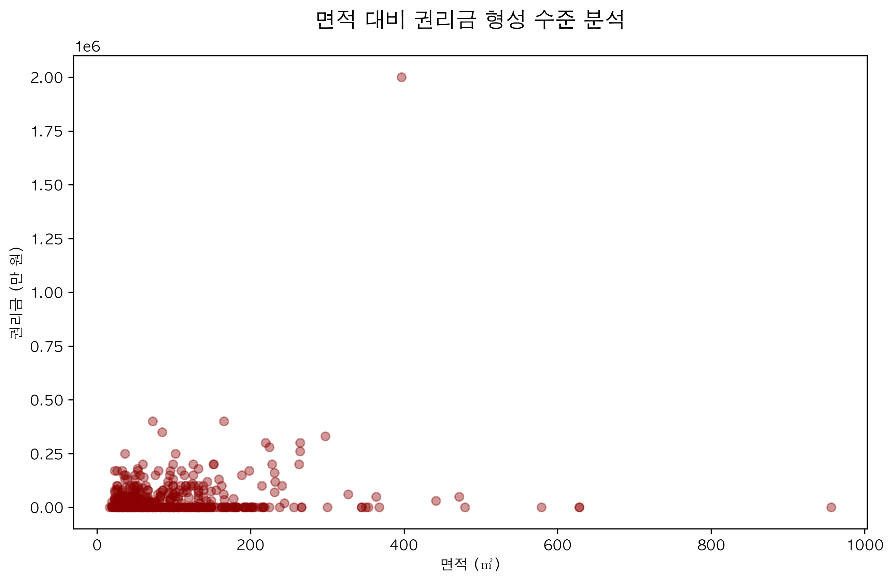
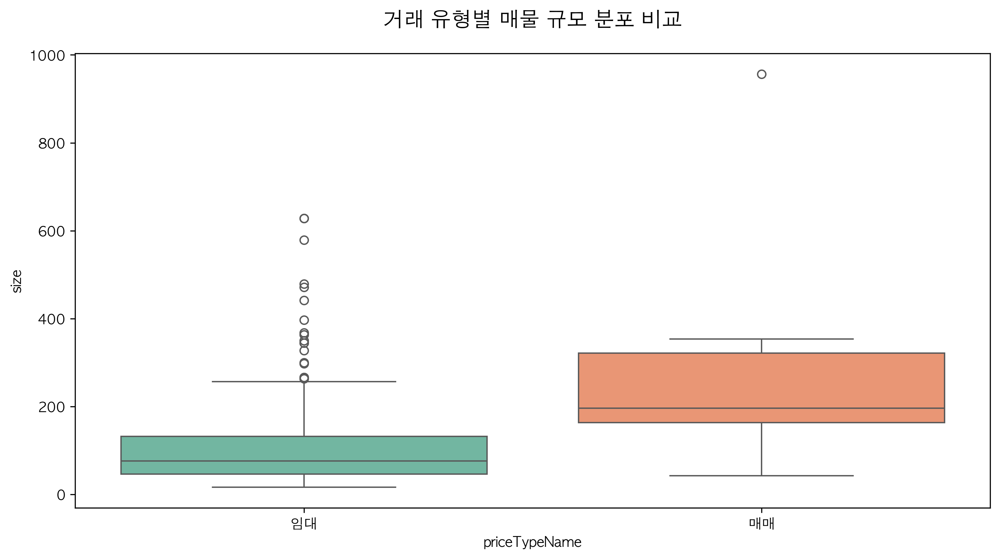
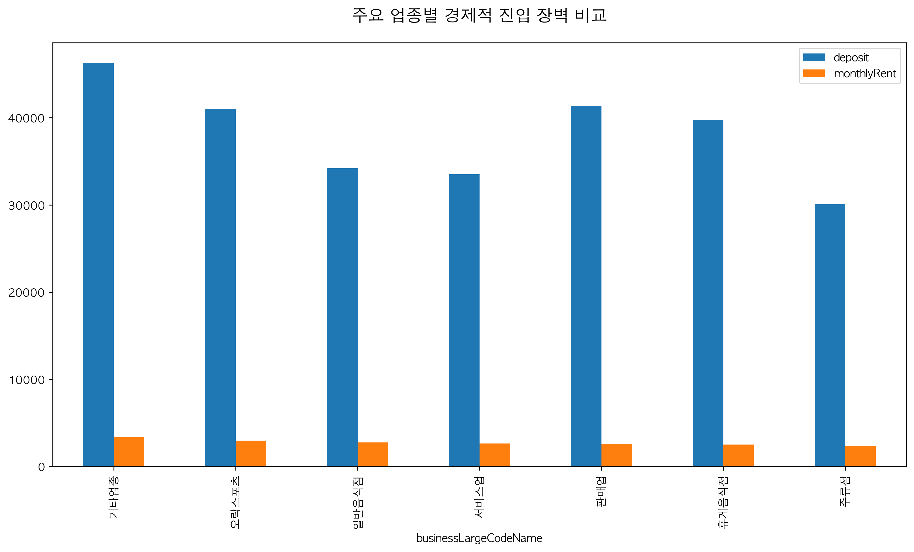

# **네모 상가 데이터 EDA 리포트**
### 심층 분석 및 비즈니스 전략 제언

2026년 4월 29일
시니어 데이터 분석가

---

## **1. 데이터 개요**

- **전체 데이터 수**: 473행
- **변수 개수**: 40개 (수치형 22개, 범주형/텍스트 18개)
- **주요 변수**: 보증금, 월세, 권리금, 업종, 층수, 면적, 역세권 등
- **데이터 특징**: 서울 주요 핵심 상권(양재, 역삼, 도곡)의 상업용 부동산 매물 데이터

---

## **2. 수치형 데이터 분석 요약**

- **임대료 구조**: 보증금(평균 4,059만)과 월세(평균 296만)의 **초양극화** 현상 뚜렷
- **권리금**: 평균 4,260만 원이나 **'무권리'** 매물이 25% 이상 차지 (경기 침체 반영)
- **물리적 특성**: 평균 면적 약 31평(103㎡), 1층 매물이 압도적 다수
- **시장 심리**: 조회수 대비 찜수가 낮아 사용자들이 매우 **보수적으로 탐색** 중

---

## **3. [시각화] 업종 대분류 빈도 분포**

- **음식점업 중심**: 일반음식점 및 휴게음식점이 전체의 중심축 형성
- **인사이트**: 강력한 소비 상권임을 입증하나, 치열한 경쟁(Red Ocean) 예고

---

## **4. [시각화] 거래 형태 및 보증금 분포**

| 거래 형태 (임대 vs 매매) | 보증금 구간 분포 |
| :---: | :---: |
|  |  |
- **임대 위주**: 98.7%가 임대차 계약 (수익형 부동산 특성)
- **경제적 문턱**: 2,000만~5,000만 원 구간에 매물 최다 밀집

---

## **5. [시각화] 보증금-월세 상관관계**

- **상관계수 0.81**: 입지 가치가 가격에 매우 정직하게 반영됨
- **전략**: 이상치(Outlier) 매물을 발굴하여 자금 효율성 극대화 필요

---

## **6. [시각화] 업종별 임대료(월세) 순위**

- **고비용 업종**: 이동통신점, 스크린골프장, 병원 등 (고수익 구조)
- **생활 밀착형**: 카페, 음식점은 상대적으로 낮은 임대료 형성 (이면도로 진출 활발)

---

## **7. [시각화] 층수별 공급 및 면적-권리금**

| 건물 층수별 현황 | 면적 vs 권리금 상관관계 |
| :---: | :---: |
|  |  |
- **1층 절대우위**: 접근성이 가치를 결정 (지하층도 15%로 견고한 수요)
- **권리금 특징**: 면적보다는 **시설 투자 및 단골 확보** 수준에 더 큰 영향

---

## **8. [시각화] 역세권 관심도 및 매물 규모**

| 주요 역세권별 조회수 | 거래 유형별 면적 비교 |
| :---: | :---: |
|  |  |
- **골든 라인**: 양재, 역삼, 도곡역 인근 도보 10분 내 매물에 관심 집중
- **자산 규모**: 매매 매물이 임대 대비 대형 평수 위주로 형성

---

## **9. [시각화] 업종별 진입 장벽 및 키워드**

| 업종별 보증금/월세 평균 | 매물 제목 키워드 분석 |
| :---: | :---: |
|  |  |
- **진입 비용**: 판매업 및 기타업종이 높은 경제적 장벽 형성
- **3대 키워드**: **#무권리 #인테리어 #역세권**

---

## **10. 종합 비즈니스 전략 제언**

1. **입지 전략**: 역세권 프리미엄은 불변. 단, 가성비를 위해 도보 15분 내외 '강력한 개별 장점' 매물 주목
2. **업종 틈새**: 과밀화된 외식업 대신 배후 주거 수요를 겨냥한 **서비스업(미용, 교육)** 기회 포착
3. **권리금 활용**: '무권리' 매물의 함정을 조심하되, 초기 자금 절감을 위한 **교차 검증** 필수
4. **마케팅 차별화**: 단순 가격 노출보다 **감성 키워드(채광, 인테리어)**를 활용한 브랜딩 중요

---

# **감사합니다!**
**Q&A**
